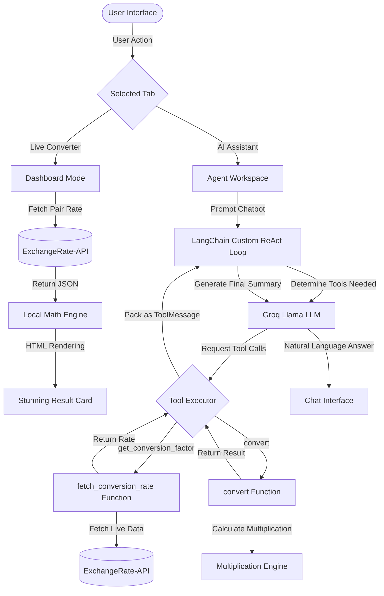

# FX-AI Nexus: System Architecture & User Guide

Welcome to the **FX-AI Nexus** project! This guide provides a detailed overview of the system architecture, request processing workflow, and instructions on how to use both the interactive web dashboard and the AI Assistant.

---

## 1. Project Technology Stack

- **Frontend Interface**: Streamlit (Python-based web app)
- **Styling & UI**: Custom HTML5 & CSS (Glassmorphism layout, hover scale translations, dark-mode gradients, rotating icons, glowing UI cards)
- **AI Orchestration**: LangChain Core (run-loop agent binding, system/human messaging, custom tool outputs parsing)
- **LLM Engine**: Groq Cloud (`llama-3.1-8b-instant` or similar Llama models) or OpenAI GPT models
- **Data Source**: ExchangeRate-API (realtime rates updated dynamically)

---

## 2. System Architecture & Request Flows

The system operates in two core modes: **Dashboard Mode** (instant rates calculation) and **AI Agent Mode** (autonomous tool calling).

### System Component Map

---

## 3. How the Process Works (Mechanics)

### A. Live Market Grid & Manual Converter
1. **Interactive Swap**: When you click the **🔄 Swap** button, Streamlit updates the session state keys for the selected currencies, triggering a smooth CSS rotate animation and swapping the Source and Target currency selectors.
2. **Dynamic Rates**: The application sends a `GET` request to `https://v6.exchangerate-api.com/v6/latest/{from_curr}`.
3. **HTML Compiler**: The returned conversion rates are compiled into clean HTML cards. The code handles trailing spaces safely to prevent Markdown code block rendering bugs.

### B. The AI Agent Loop (Sequential Tool Execution)
When you ask the AI Chatbot a query like: *"Convert 150 EUR to USD and compare their strength"*

1. **Step 1: Parse Intent**  
   The user prompt is passed to the LLM (e.g. Groq Llama-3). The model determines that it needs external real-time data and calls the appropriate tools.
2. **Step 2: First Tool (Exchange Rate)**  
   The model requests a tool call: `get_conversion_factor(base_currency="EUR", target_currency="USD")`.
3. **Step 3: Sequential Value Injection**  
   The custom loop executes the tool, gets the conversion rate (e.g. `1.08`), and saves it. It then injects this rate into the next tool call.
4. **Step 4: Second Tool (Calculation)**  
   The model requests the second tool call: `convert(base_currency_value=150.0, conversion_rate=1.08)`. The tool executes and returns `162.0`.
5. **Step 5: Final Summary**  
   Both tool execution messages are appended to the chat history. The LLM processes them and generates a clean, conversational summary: *"150 EUR converts to 162.00 USD (at a rate of 1.0800). Currently, the Euro is stronger than the US Dollar..."*

---

## 4. How to Use the Application

### 📈 Tab 1: Live Converter Dashboard
- **Source & Target Dropdowns**: Select your currencies from the 160+ options. Typing in the selector lets you search instantly.
- **🔄 Swap**: Click to instantly swap source and target currencies.
- **Amount**: Enter the amount in the input field. The conversion card below will update instantly with the exchange rate and timestamp.
- **Live Market Grid (Right Panel)**: Displays popular rates relative to your selected Source currency.

### 🤖 Tab 2: AI Conversion Assistant
- **Quick Prompts**: Click one of the preset buttons (e.g., *"Convert 150 EUR to USD and detail rates"*) to see the agent run automatically.
- **Chat Input**: Type any conversion question (e.g., *"How much is 400 CAD in Indian Rupees, and is CAD stronger than USD?"*).
- **Thinking Accordion**: Click **🛠️ View Agent Thinking & Tool Logs** inside the bot's response to see exactly which tools the agent ran, the parameters it used, and the API return payloads.

---

## 5. Security & Key Management
- **Environment variables**: All keys (`GROQ_API_KEY`, `EXCHANGERATE_API_KEY`) are kept inside `.env` which is excluded from public Git tracking.
- **On-Screen Security**: The sidebar checks if keys are present in the environment variables and hides the password fields, displaying a green secure badge (`🔑 Groq Key: Active from Environment`) so your keys are never exposed during screen-sharing or presentation.
